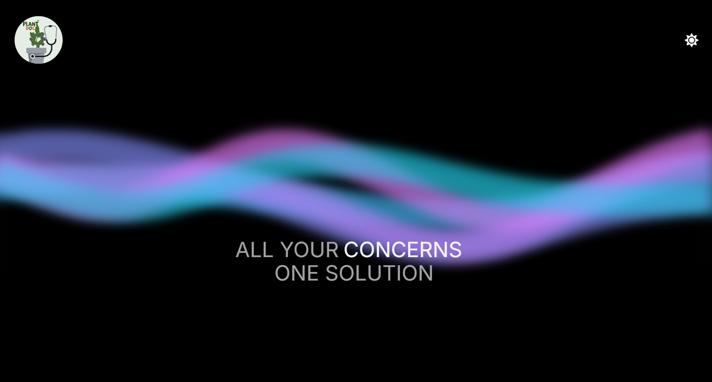
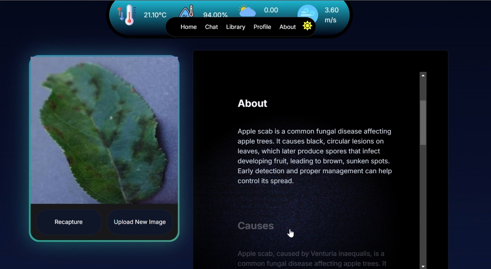
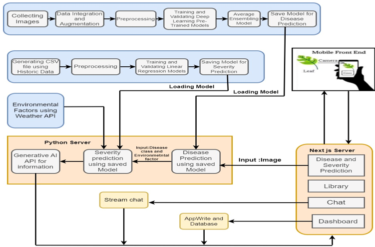

This is a [Next.js](https://nextjs.org/) project bootstrapped with [`create-next-app`](https://github.com/vercel/next.js/tree/canary/packages/create-next-app).

## Getting Started

First, run the development server:

```bash
npm run dev
# or
yarn dev
# or
pnpm dev
# or
bun dev
```

Open [http://localhost:3000](http://localhost:3000) with your browser to see the result.

You can start editing the page by modifying `app/page.tsx`. The page auto-updates as you edit the file.

## About Project





This is an AI Driven Crop Disease Detection System made using following tech stack :
JavaScript, React, NextJs, TailwindCSS, ShandCN,
AceternityUI, FastAPI, Python, Mistral AI, OpenCV, numpy

It uses two servers - one in Next.js and another in FastAPI (Python). After running Next.js server, we will have to run FastAPI server using command `fastapi dev prediction_server.py` which can be found in `Models` folder.

[Open-Meteo](https://open-meteo.com/) is used for fetching real time weather data.

`Models` folder contains the python server, data for training and testing and the trained model.

This project Mistral AI for generating text.

## Workflow




## Learn More

To learn more about this project, you can watch this [Youtube Video](https://www.youtube.com/watch?v=yMERHD2QKTg)

To learn more about Next.js, take a look at the following resources:

- [Next.js Documentation](https://nextjs.org/docs) - learn about Next.js features and API.
- [Learn Next.js](https://nextjs.org/learn) - an interactive Next.js tutorial.

You can check out [the Next.js GitHub repository](https://github.com/vercel/next.js/) - your feedback and contributions are welcome!

## Deploy on Vercel

The easiest way to deploy your Next.js app is to use the [Vercel Platform](https://vercel.com/new?utm_medium=default-template&filter=next.js&utm_source=create-next-app&utm_campaign=create-next-app-readme) from the creators of Next.js.

Check out our [Next.js deployment documentation](https://nextjs.org/docs/deployment) for more details.
