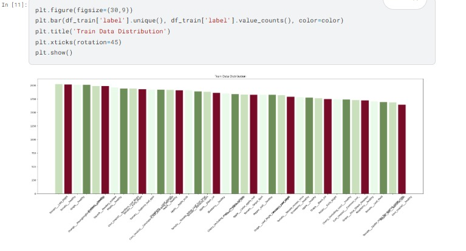

# Agriguardian

_A comprehensive AI-driven crop disease detection system_


Agriguardian leverages state-of-the-art technologies across both the frontend and backend to deliver an interactive, accurate, and responsive platform for crop disease diagnosis and treatment advice. The system combines modern frameworks with powerful AI and image processing libraries to offer actionable insights and recommendations to its users.

---

## Table of Contents

- [Agriguardian](#agriguardian)
  - [Table of Contents](#table-of-contents)
  - [Project Overview](#project-overview)
  - [Tech Stack](#tech-stack)
  - [Features](#features)
  - [Methodology](#methodology)
    - [Image Analysis](#image-analysis)
    - [Environmental Factors Integration](#environmental-factors-integration)
    - [Model Loading \& Serving](#model-loading--serving)
    - [Frontend Integration](#frontend-integration)
    - [User Interaction](#user-interaction)
    - [Selling Advice](#selling-advice)
    - [Discussion Forums](#discussion-forums)
  - [Running on Local System](#running-on-local-system)
    - [API Keys](#api-keys)
    - [Method 1: Cloning the Repository](#method-1-cloning-the-repository)
      - [Prequesites](#prequesites)
      - [Steps](#steps)
    - [Method 2: Docker Compose](#method-2-docker-compose)
      - [Prequesites](#prequesites-1)
      - [Steps](#steps-1)
  - [Note](#note)

---

## Project Overview

Agriguardian is an AI-powered crop disease detection system designed to:
- Diagnose crop diseases with up to **94% accuracy**
- Predict disease severity using image analysis combined with real-time weather data
- Offer actionable treatment, fertilizer, and selling advice through AI-generated recommendations
- Engage users with interactive discussion forums and a comprehensive disease information library

---

## Tech Stack

- **Frontend:**
  - **Next.js:** For full-stack development and interactive UI
  - **React:** Component-based architecture
  - **TailwindCSS:** Utility-first CSS framework for styling
  - **AceternityUI & ShandCN:** Pre-built UI components for rapid development

- **Backend:**
  - **FastAPI (Python):** Serving AI-related APIs
  - **OpenCV & numpy:** For robust image processing and data analysis
  - **Gemini AI:** For generating text-based insights and recommendations
  - **Langchain:** For interacting with large language models and creating AI agents
  - **SerpAPI:** For web scraping to gather selling advice data

- **Data Integration:**
  - **Open-Meteo:** For real-time weather data integration

---

## Features

- **Accurate Crop Disease Detection:** Achieves up to 94% accuracy using a fine-tuned InceptionV3 model
  - 
- **Diverse Training:** Trained on 38 different disease classes
  - 
- **Interactive User Interface:** Responsive design with clear modals and information displays
  - 
- **Comprehensive Disease Insights:** Severity, causes, prevention strategies, and post-disease effects
  - 
- **AI-Powered Selling Advice:** Utilizes web scraping and Langchain for market insights
  - 
- **Community Engagement:** In-app discussion forums for user interaction and knowledge sharing
  - 
- **User Profiles & Library:** Personalized experience with curated content on crop diseases and government schemes

---

## Methodology

The system integrates multiple processes and technologies to deliver real-time and reliable insights.

### Image Analysis

1. **Data Preparation & Model Training**
   - **Image Collection & Augmentation:** Gather and augment crop images to diversify the dataset.
   - **Preprocessing:** Resize, normalize, and enhance images.
   - **Integration & Preparation:** Consolidate images with labels.
   - **Model Training:** Fine-tune a pre-trained InceptionV3 model and utilize ensemble methods for enhanced accuracy.
   - **Model Saving:** Two models are maintained—one for disease detection and another for severity prediction.

### Environmental Factors Integration

- **Weather API:** Fetches real-time weather data (temperature, humidity, etc.) from Open-Meteo.
- **Data Fusion:** Integrates weather data with image analysis to adjust severity predictions based on environmental factors.

### Model Loading & Serving

- **Backend Initialization:** The FastAPI server loads both the disease detection and severity prediction models.
- **Processing Pipeline:** Upon receiving an image, the backend performs:
  - Disease identification via the detection model.
  - Severity prediction by combining image data and environmental parameters.

### Frontend Integration

- **User Request Handling:** The Next.js server handles image uploads and diagnosis requests.
- **Data Display:** Receives predictions from the backend and displays disease type, severity, and AI-generated treatment insights.
- **Dashboard & Library:** Offers additional resources including a library of crop diseases and treatment plans.

### User Interaction

- **Insights & Recommendations:** Provides treatment suggestions, fertilizer advice, and prevention tips through Gemini AI.
- **Interactive UI:** Enables users to engage with real-time chat features and view modals for detailed information.

### Selling Advice

- **Web Scraping:** Uses SerpAPI to collect selling advice from multiple sources.
- **Langchain Integration:** Processes and standardizes scraped data.
- **AI Recommendations:** Gemini AI formulates text-based selling advice tailored to current market conditions.

### Discussion Forums

- **Platform:** Powered by GetStream for real-time discussion and community support.
- **User Engagement:** Facilitates Q&A, community discussions, and knowledge sharing among users.

---


## Running on Local System

### API Keys

Get your API keys from:
- Gemini AI API Key: [https://aistudio.google.com/app/apikey](https://aistudio.google.com/app/apikey)
- Clerk Publishable Key and Secret Key: [https://dashboard.clerk.dev/](https://dashboard.clerk.dev/)
- GetStream API Key and API Secret: [https://getstream.io/](https://getstream.io/)
- SerpAPI API Key: [https://serpapi.com/dashboard](https://serpapi.com/dashboard)

---

### Method 1: Cloning the Repository

#### Prequesites

- [Node.js (version 18 or higher)](https://nodejs.org/en/download)
- [Python (version 3.10 or higher)](https://www.python.org/downloads/)
- [Git (version 2.25 or higher)](https://git-scm.com/downloads)

#### Steps

1. Clone the repository from GitHub:
   ```bash
   git clone https://github.com/SaadZiaatharKhan/Agriguardian-AI_Crop_Disease_Detection_and_Treatment_Advisor.git
   ```

2. Navigate to the project directory

3. Create .env.local file and add your credentials:

    <details>
    <summary><code>.env.local</code></summary>
    
    ```bash
    NEXT_PUBLIC_GEMINI_API_KEY=
    NEXT_PUBLIC_CLERK_PUBLISHABLE_KEY=
    CLERK_SECRET_KEY=
    GETSTREAM_API_KEY=  
    GETSTREAM_API_SECRET=
    NEXT_PUBLIC_SERPAPI_KEY=
    ```
    </details>

3. Install dependencies:

    In root folder open terminal and run:
   ```bash
   npm install
   ```
   In Models folder open terminal and run:
   ```bash
   pip install -r requirements.txt
   ```

4. Start the development server:
   
   In Models folder open terminal and run:
   ```bash
   uvicorn prediction_server:app --reload --host 0.0.0.0
   ```
   In root folder open terminal and run:
   ```bash
   npm run dev
   ```
5. Open [http://localhost:3000](http://localhost:3000) to see the application.

---

### Method 2: Docker Compose

#### Prequesites

- [Docker (version 20.10 or higher)](https://www.docker.com/products/docker-desktop/)

#### Steps

1. Create a folder named `Agriguardian` and navigate to it.

2. Create docker compose file with your credentials : 

    <details>
    <summary><code>compose.yaml</code></summary>
    
    ```yaml
        services:
            agriguardian_nextjs:
                image:
                    saad0405/agriguardian_nextjs
                depends_on:
                    - agriguardian_python
                ports:
                    - 3000:3000
                environment:
                    - NEXT_PUBLIC_GEMINI_API_KEY=
                    - NEXT_PUBLIC_CLERK_PUBLISHABLE_KEY=
                    - CLERK_SECRET_KEY=
                    - API_KEY= 
                    - API_SECRET=
                    - NEXT_PUBLIC_SERPAPI_KEY=

            agriguardian_python:
                image:
                    saad0405/agriguardian_python
                ports:
                    - 8000:8000

        volumes:
            tasked:
    ```   
    </details>

3. Run the following command:

    ```bash
    docker-compose up
    ```

4. Open [http://localhost:3000](http://localhost:3000) to see the application.

---

## Note

1. **Prototype Status:** This application is a prototype and is not intended for commercial use.
2. **Development Stage:** The project is still in development; bugs or issues may be present.
3. **Severity & Fertilizer Models:** The severity prediction model uses simulated data for prototyping, and AI-generated fertilizer suggestions should be verified with professionals.
4. **Treatment Data:** The treatment plan data in [location](./data/diseaseData.json) is provided solely for prototyping purposes.
5. **Chat Functionality:** The chat application may not function as intended.
6. **Professional Advice:** Always consult agricultural professionals for critical advice.

---